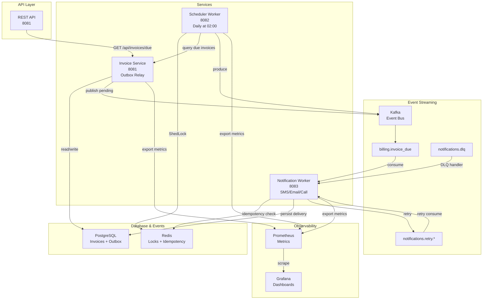

# Notification Service

A production-ready, event-driven notification service built with Java 21 and Spring Boot 3.5. This microservices architecture demonstrates modern patterns including the Transactional Outbox Pattern, distributed scheduling with ShedLock, idempotent message consumption, and comprehensive observability.

## Quick Start

### Prerequisites
- Java 21+
- Maven 3.8+
- Docker & Docker Compose

### Run All Services

```bash
# Start all infrastructure (PostgreSQL, Redis, Kafka, Grafana)
docker-compose up -d

# Wait for services to be healthy
sleep 30

# Build and run all services
./mvnw clean install
./mvnw -pl invoice-service spring-boot:run &
./mvnw -pl scheduler-worker spring-boot:run &
./mvnw -pl notification-worker spring-boot:run &
```

## Architecture



## Services

### 1. Invoice Service (Port 8081)

REST API for managing invoices with integrated Transactional Outbox Pattern.

**Key Features:**
- **REST Endpoints:**
  - `GET /api/invoices/due?date=2026-09-28` - Get invoices due on a specific date
  - `GET /actuator/health` - Service health
  - `GET /actuator/prometheus` - Prometheus metrics

- **Database Schema:**
  - `invoices` table: Stores invoice data (id, user_id, amount, due_date, status)
  - `outbox` table: Implements Transactional Outbox Pattern

- **Transactional Outbox Pattern:**
  - When invoice status changes to `NOTIFICATION_NEEDED`, an event is inserted into the `outbox` table in the same transaction
  - `OutboxRelayService` polls the outbox every 5 seconds and publishes pending events to Kafka
  - Once published successfully, events are marked as `PUBLISHED`
  - Failed publishes are marked as `FAILED` for manual inspection

- **Database Migrations:** Flyway manages schema versioning (V1: invoices, V2: outbox)

**Configuration (application.yml):**
```yaml
spring:
  datasource:
    url: jdbc:postgresql://localhost:5432/notification_db
  kafka:
    bootstrap-servers: localhost:9092
  jpa:
    hibernate:
      ddl-auto: validate
```

### 2. Scheduler Worker (Port 8082)

Scheduled worker for detecting invoices due in the near future.

**Key Features:**
- **Cron Schedule:** Runs daily at 02:00 UTC
  - `@Scheduled(cron="0 0 2 * * *")`
  - Queries invoice-service for invoices due in 3 days
  - Uses ShedLock with Redis to prevent duplicate execution in clustered deployments

- **ShedLock Configuration:**
  ```java
  @Scheduled(cron="0 0 2 * * *")
  @SchedulerLock(name="dailyInvoiceCheck", lockAtLeastFor="PT5M")
  public void checkDueInvoices() { ... }
  ```

- **Event Production:**
  - Publishes `InvoiceDueEvent` to Kafka topic `billing.invoice_due`
  - Each event contains: eventId, invoiceId, userId, dueDate, channel, templateId, attempt

**Implementation (Phase 2 - Complete):**

✅ **OpenFeign Client (InvoiceServiceClient)**
```java
@FeignClient(name = "invoice-service", url = "${invoice-service.url}")
public interface InvoiceServiceClient {
    @GetMapping("/api/invoices/due")
    List<InvoiceDto> getDueInvoices(@RequestParam LocalDate date);
}
```
- Configurable URL via `invoice-service.url` property
- Maps invoice DTO responses
- Integrated error handling with Spring retry

✅ **ShedLock with Redis**
```java
@EnableSchedulerLock(defaultLockAtMostFor = "PT4M59S")
public class SchedulerConfiguration {
    @Bean
    public LockProvider lockProvider(RedisConnectionFactory cf) {
        return new RedisLockProvider(cf);
    }
}
```
- Distributed lock provider using Redis
- Prevents duplicate execution in multi-instance deployments
- Lock key stored in Redis with TTL
- Configuration: `net.javacrumbs.shedlock:shedlock-provider-redis-spring:5.9.1`

✅ **Scheduled Task with ShedLock**
```java
@Scheduled(cron = "0 0 2 * * *")
@SchedulerLock(
    name = "dailyInvoiceCheck",
    lockAtMostFor = "4m59s",
    lockAtLeastFor = "5m"
)
public void checkDueInvoices() { ... }
```
- Runs daily at 02:00 UTC
- Lock held for at least 5 minutes (prevents quick re-execution)
- Lock released after 5 minutes max
- Queries invoices due in 3 days (today + 3 days)

✅ **Kafka Producer Configuration**
- Serializer: JsonSerializer for InvoiceDueEvent
- Acks: `all` (ensures delivery)
- Retries: 3
- Batch settings for throughput optimization
- Topic: `billing.invoice_due` (auto-created by Kafka)

✅ **Error Handling & Logging**
- Graceful error handling with proper exception wrapping
- Debug logging for troubleshooting
- ShedLock debug logging for lock lifecycle
- Metrics exported to Prometheus

**Metrics Exposed:**
- Via `/actuator/prometheus` on port 8082
- JVM metrics, Spring Kafka producer metrics
- Scheduled task execution count and duration

### 3. Notification Worker (Port 8083)

Consumes invoice due events and sends notifications across multiple channels.

**Key Features:**
- **Kafka Consumer:**
   - Listens to `billing.invoice_due` topic with consumer group `notification-group`
   - Implements idempotency using Redis SET with NX flag
   - Falls back to database unique constraint on (invoice_id, channel)

- **Channel Strategy Pattern:**
   ```java
   interface NotificationSender {
       boolean supports(String channel);
       void send(InvoiceDueEvent event);
   }
   ```
   Implementations: SmsSender, EmailSender, CallSender (mock/logging only for Phase 2)

- **Retry & DLQ Strategy:**
   - `@RetryableTopic` with exponential backoff: 2s, 8s, 32s (attempts: 1-4)
   - Retry topics: `notifications.retry.sms`, `notifications.retry.email`, etc.
   - Dead Letter Queue (DLQ) topic: `notifications.dlq`
   - `@DltHandler` receives final failures for logging/alerting

- **Idempotency:**
   - Redis: `SET key=idemp:invoiceId:channel NX EX 86400`
   - Database: `notification_deliveries` table with UNIQUE(invoice_id, channel)
   - Prevents duplicate notifications even with retries

- **Metrics:**
   - Counter: `notifications.sent` (by channel, by status)
   - Counter: `notifications.failed`
   - Counter: `notifications.dlq`
   - Expose at `GET /actuator/prometheus`

**Future Implementation (Phase 3):**
- Actual SMS/Email integrations (mock now)
- Detailed tracing for troubleshooting
- Channel-specific retry policies

## Kafka Topics

| Topic | Partitions | Purpose |
|-------|-----------|---------|
| `billing.invoice_due` | 3 | Primary invoice due event stream |
| `notifications.retry.sms` | 1 | SMS delivery retries |
| `notifications.retry.email` | 1 | Email delivery retries |
| `notifications.retry.call` | 1 | Call delivery retries |
| `notifications.dlq` | 1 | Dead Letter Queue for all channels |

## Database Schema (PostgreSQL)

### invoices
```sql
CREATE TABLE invoices (
    id UUID PRIMARY KEY,
    user_id VARCHAR(255) NOT NULL,
    amount NUMERIC(19, 2) NOT NULL,
    due_date DATE NOT NULL,
    status VARCHAR(50) NOT NULL,
    created_at TIMESTAMP NOT NULL,
    updated_at TIMESTAMP NOT NULL
);
-- Indexes on: due_date, status
```

### outbox
```sql
CREATE TABLE outbox (
    id UUID PRIMARY KEY,
    aggregate_id VARCHAR(255) NOT NULL,
    topic VARCHAR(255) NOT NULL,
    payload TEXT NOT NULL,
    status VARCHAR(50) NOT NULL,
    created_at TIMESTAMP NOT NULL,
    published_at TIMESTAMP
);
-- Indexes on: status, created_at
```

### notification_deliveries (Phase 2)
```sql
CREATE TABLE notification_deliveries (
    id UUID PRIMARY KEY,
    invoice_id VARCHAR(255) NOT NULL,
    channel VARCHAR(50) NOT NULL,
    status VARCHAR(50) NOT NULL,
    created_at TIMESTAMP NOT NULL,
    UNIQUE(invoice_id, channel)
);
```

## Tech Stack

| Component | Version | Purpose |
|-----------|---------|---------|
| Java | 21 | Language |
| Spring Boot | 3.5.0 | Framework |
| Spring Data JPA | 3.5.0 | Database ORM |
| Spring Kafka | 3.5.0 | Event streaming |
| Spring Data Redis | 3.5.0 | Distributed locks & caching |
| PostgreSQL | 16 | Primary database |
| Redis | 7 | Locks & caching |
| Kafka | 3.7 (KRaft) | Event broker |
| ShedLock | Latest | Distributed scheduling |
| Flyway | 9.x | Database migrations |
| MapStruct | 1.5.5 | DTO mapping |
| Lombok | 1.18.30 | Boilerplate reduction |
| Micrometer | 1.12+ | Metrics & observability |
| OpenTelemetry | Latest | Distributed tracing |
| Testcontainers | 1.19.8 | Integration testing |

## Running Tests

```bash
# Unit tests
./mvnw test

# Integration tests (with Testcontainers)
./mvnw verify

# Specific module
./mvnw -pl invoice-service test
```

## Monitoring & Observability

### Health Checks
```bash
curl http://localhost:8081/actuator/health
curl http://localhost:8082/actuator/health
curl http://localhost:8083/actuator/health
```

### Prometheus Metrics
```bash
curl http://localhost:8081/actuator/prometheus
```

### Grafana Dashboards
Access at `http://localhost:3000`
- User: admin
- Password: admin

**Dashboard:** Import official Spring Boot dashboards for:
- JVM metrics
- Kafka consumer lag
- HTTP request latency
- Exception rates

## Troubleshooting

### Kafka Connection Issues
```bash
# Check Kafka broker health
docker exec notification-kafka kafka-broker-api-versions --bootstrap-server localhost:9092

# List topics
docker exec notification-kafka kafka-topics --list --bootstrap-server localhost:9092

# Monitor consumer lag
docker exec notification-kafka kafka-consumer-groups --group notification-group \
  --bootstrap-server localhost:9092 --describe
```

### Database Issues
```bash
# Check PostgreSQL
docker exec notification-postgres psql -U postgres -c "SELECT * FROM invoices;"

# View Outbox status
docker exec notification-postgres psql -U postgres -c "SELECT * FROM outbox;"
```

### Redis Issues
```bash
# Check Redis
docker exec notification-redis redis-cli ping

# View keys
docker exec notification-redis redis-cli KEYS "*"
```

## Development Workflow

### Code Style
- Constructor injection only (no field injection)
- Lombok for boilerplate (@Data, @RequiredArgsConstructor, etc.)
- MapStruct for DTO conversions
- Comprehensive logging with SLF4J

### Testing Strategy
- Unit tests for business logic
- Integration tests using Testcontainers for databases/brokers
- Contract tests for service interactions

### Building & Packaging
```bash
# Build all modules
./mvnw clean package

# Build specific module
./mvnw -pl invoice-service clean package

# Skip tests
./mvnw clean package -DskipTests

# Build Docker images (future)
./mvnw spring-boot:build-image
```

## Future Enhancements (Phase 2+)

1. **Scheduler Worker:**
   - Implement OpenFeign client
   - Add ShedLock with JDBC backend
   - Comprehensive error handling

2. **Notification Worker:**
   - Real SMS/Email integrations (Twilio, SendGrid)
   - Template engine for dynamic content
   - Advanced retry policies per channel
   - Delivery tracking and analytics

3. **API Gateway:**
   - Spring Cloud Gateway for routing
   - Rate limiting & circuit breaking
   - Request/response logging

4. **Configuration Management:**
   - Spring Cloud Config Server
   - Dynamic property refresh
   - Environment-specific profiles

5. **Resilience:**
   - Resilience4J for circuit breaking
   - Bulkhead pattern for resource isolation
   - Distributed tracing with OpenTelemetry

6. **Testing:**
   - Chaos engineering tests
   - Performance benchmarking
   - Load testing with K6/Gatling

## Contributing

1. Clone the repository
2. Create feature branch: `git checkout -b feature/my-feature`
3. Commit with conventional commits: `git commit -m "feat: add new feature"`
4. Push to branch: `git push origin feature/my-feature`
5. Create Pull Request

## License

MIT License - see LICENSE file for details

## Support

For issues and questions:
- Check existing GitHub Issues
- Review architecture documentation
- Consult troubleshooting guide above
- Contact: support@notification-service.dev
