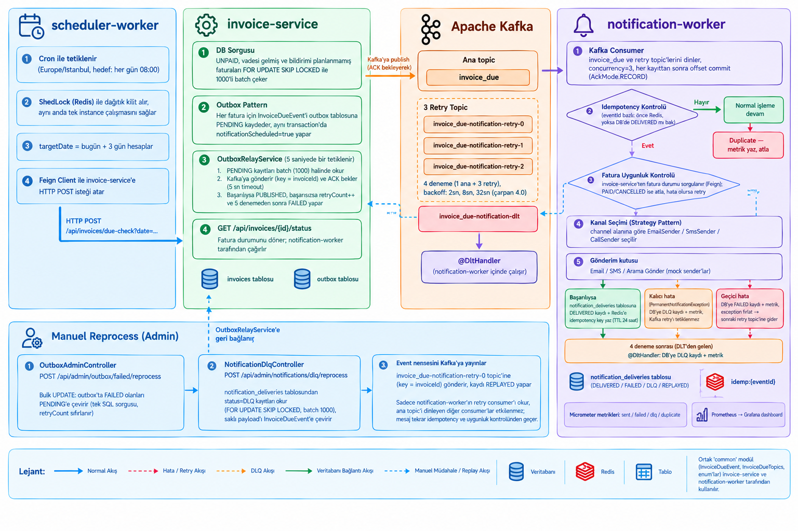

# Notification Service

An event-driven invoice-due notification system built with Java 21 and Spring Boot 3.5. It demonstrates the Transactional Outbox pattern, Kafka non-blocking retries with a dead letter topic, idempotent consumption, distributed scheduling with ShedLock, and metrics-based observability.

Three services work together:

| Service | Role | Port |
|---|---|---|
| `scheduler-worker` | Cron trigger. Calls `invoice-service` once a day and holds no business logic. | 8082 |
| `invoice-service` | Finds due invoices, writes events to an outbox table, relays them to Kafka. | 8081 |
| `notification-worker` | Consumes events and sends notifications (mock senders) with retry, idempotency and DLQ handling. | 8083 |

Shared contracts (`InvoiceDueEvent`, `InvoiceDueTopics`, enums) live in the `common` module.

> **Status:** this is a reference implementation. Senders are mocks, and `EmailSender` injects random failures for chaos testing. See [Known limitations](#known-limitations) before using it with real providers.

## Architecture



### Concepts

- **Outbox:** the event is written to the database in the same transaction as the business change, then published to Kafka by a separate relay. This closes the "saved in DB but never reached Kafka" gap.
- **Retry:** transient failures are retried through Kafka retry topics with exponential backoff instead of blocking the main topic.
- **Idempotency:** the same `eventId` never produces a second notification, even if the event is delivered twice.
- **DLT vs DLQ:** *DLT* is the Kafka dead letter **topic** (`invoice-due-notification-dlt`). *DLQ* is a **status** in the `notification_deliveries` table, used for events that need manual attention (permanent errors and events whose retries are exhausted).

## Services

### 1. scheduler-worker

A stateless trigger with no business logic.

- Runs daily at 08:00 (`Europe/Istanbul`) with `@Scheduled(cron = "0 0 8 * * *", zone = "Europe/Istanbul")`.
- Takes a distributed lock with ShedLock on Redis (lock name `dailyInvoiceCheck`, `lockAtMostFor = 10m`, `lockAtLeastFor = 1m`), so only one instance runs at a time.
- Computes `targetDate = today + 3 days` and calls `POST /api/invoices/due-check?date=<targetDate>` on `invoice-service` through an OpenFeign client (`invoice-service.url`, default `http://localhost:8081`).

### 2. invoice-service

Produces the events.

**Due check** (`POST /api/invoices/due-check`)
- Selects invoices with `status = UNPAID`, `due_date <= :date` (overdue invoices included) and `notification_scheduled = false`, using `FOR UPDATE SKIP LOCKED` in batches of 1000. Concurrent instances skip locked rows instead of waiting.
- Per batch, in **one transaction**: inserts one `InvoiceDueEvent` per invoice into the `outbox` table as `PENDING` and sets `notification_scheduled = true`. Batches repeat until nothing is left.
- Events are never sent to Kafka directly.

**OutboxRelayService**
- Runs every 5 seconds, reads up to 1000 `PENDING` rows, and publishes each to Kafka with `key = invoiceId`, waiting for the broker ACK (5 s timeout).
- Success: row becomes `PUBLISHED`. Failure: `retryCount++`, and after 5 failures the row becomes `FAILED`.

**Other endpoints**

| Endpoint | Purpose |
|---|---|
| `GET /api/invoices/{id}/status` | Current invoice status. Called by `notification-worker` before sending. |
| `POST /api/admin/outbox/failed/reprocess` | Bulk-updates `FAILED` outbox rows back to `PENDING` and resets `retryCount`. The relay then picks them up again with the same payload and `eventId`. |

**Event contract**

```java
public record InvoiceDueEvent(
    UUID eventId, UUID invoiceId, String userId,
    LocalDate dueDate, String channel, String topic) {}
```

`channel` is currently always `EMAIL`.

### 3. notification-worker

Consumes `invoice-due` and its retry topics (`@RetryableTopic` + `@KafkaListener`, container concurrency 3, offset commit after every record).

For each event, `process()` runs these steps in order:

1. **Idempotency check:** looks for `idemp:{eventId}` in Redis; if missing, checks `notification_deliveries` for a `DELIVERED` row (and re-warms Redis on a hit). A duplicate is counted in `notifications.duplicate` and stops without retry.
2. **Eligibility check:** calls `GET /api/invoices/{id}/status` on `invoice-service` via Feign. `PAID` or `CANCELLED` invoices are skipped. A failed call is treated as a transient error.
3. **Channel selection (Strategy pattern):** `EmailSender`, `SmsSender` or `CallSender`, chosen by `supports(channel)`.
4. **Send:** all senders are mocks.
5. **Record:** on success a `DELIVERED` row is written, the Redis key is set with a 24 h TTL, and `notifications.sent` is incremented. These side effects run in a guarded block, so a failure in them is logged but never triggers a retry.

**Failure handling**

| Situation | Result |
|---|---|
| Duplicate event | Metric `notifications.duplicate`, skipped. No retry. |
| Invoice is `PAID` / `CANCELLED` | Skipped; idempotency key is written. |
| Invoice status call fails | Transient error, goes to the retry chain. |
| Unsupported channel | `FAILED` row + `notifications.failed`, skipped. No retry. |
| `PermanentNotificationException` | `DLQ` row + `notifications.dlq`. No Kafka retry. |
| Transient or unexpected exception | `FAILED` row + `notifications.failed`, exception thrown, message goes to the next retry topic. |
| All 4 attempts fail | `@DltHandler` writes a `DLQ` row + `notifications.dlq`; the message stays in the DLT. |

**Retry policy:** 4 attempts in total (1 main + 3 retry topics), exponential backoff of 2 s, 8 s and 32 s (multiplier 4.0).

**Delivery statuses** (`notification_deliveries.status`): `DELIVERED`, `FAILED`, `DLQ`, `REPLAYED`.

## Kafka topics

| Topic | Purpose |
|---|---|
| `invoice-due` | Main event stream |
| `invoice-due-notification-retry-0` / `-1` / `-2` | Retry topics for the `notification-worker` consumer group |
| `invoice-due-notification-dlt` | Dead letter topic after all attempts fail |

Names and suffixes are defined once in `InvoiceDueTopics` (`common` module). The local setup creates every topic with **1 partition**, so the consumer's `concurrency=3` only gives parallelism once the topics have 3 or more partitions.

## DLQ reprocess

Nothing is retried forever. Failed work is parked and an admin decides when to replay it.

`POST /api/admin/notifications/dlq/reprocess`

1. Reads `notification_deliveries` rows with `status = DLQ` (`FOR UPDATE SKIP LOCKED`, batches of 1000).
2. Converts each stored `eventPayload` back to an `InvoiceDueEvent`.
3. Publishes the event with `key = invoiceId` to **`invoice-due-notification-retry-0`** and waits for the ACK (5 s).
4. Marks the row `REPLAYED`.

Why `retry-0` and not the main topic? Only this consumer group reads the retry topics, so other consumers of `invoice-due` are not triggered again. The replayed event goes through the idempotency and eligibility checks from the start.

A replayed event whose cause was never fixed (for example a permanently invalid recipient) fails again and returns to `DLQ`.

## Observability

- **Micrometer counters** (all tagged with `channel`):
    - `notifications.sent`: successful deliveries
    - `notifications.failed`: transient failures and unsupported channels
    - `notifications.dlq`: events written as `DLQ`, both permanent errors and DLT arrivals
    - `notifications.duplicate`: duplicates stopped by idempotency
- **Prometheus** scrapes `/actuator/prometheus` on each service (5 s interval for the three services).
- **Grafana** (`http://localhost:3000`) shows `rate()` panels for sent, failed and DLQ counters plus totals. `rate()` values are per second.
- **Kafka UI** shows the message count per topic, which makes the retry funnel visible.

## Load test (chaos run)

`EmailSender.injectChaos` throws a `PermanentNotificationException` for 5% of calls and a `TransientNotificationException` for another 15%, so about 20% of attempts fail on purpose. The numbers below come from a 10,000-event run with that failure injection, **not** from a real mail provider.

| Metric | Value |
|---|---|
| Events published to `invoice-due` | 10,000 |
| Messages in `retry-0` / `retry-1` / `retry-2` | 1,451 / 312 / 41 |
| Messages in the DLT | 9 |
| Throughput (Grafana `rate()`) | about 30 messages/s |
| Total Sent / Total Failed (Grafana) | 10,000 / 1,813 (failed *attempts*, not lost messages) |

Each retry stage shrinks the failing set by roughly the injected 15% transient rate. 9 of 10,000 events (0.09%) exhausted all four attempts and reached the DLT. Permanent errors (about 5% injected) skip the retry chain and are stored directly as `DLQ` rows, from where they can be replayed.

## Quick start

### Prerequisites
- Java 21+
- Maven 3.8+
- Docker and Docker Compose

### Run

```bash
# Infrastructure (PostgreSQL, Redis, Kafka, Prometheus, Grafana, Kafka UI)
docker-compose up -d
sleep 30

# Build and run all services
./mvnw clean install
./mvnw -pl invoice-service spring-boot:run &
./mvnw -pl scheduler-worker spring-boot:run &
./mvnw -pl notification-worker spring-boot:run &
```

### Try it

```bash
# Trigger the due check manually (use a date that matches your seed data)
curl -X POST "http://localhost:8081/api/invoices/due-check?date=2026-10-08"

# Check an invoice status
curl http://localhost:8081/api/invoices/<invoice-id>/status

# Move FAILED outbox rows back to PENDING
curl -X POST http://localhost:8081/api/admin/outbox/failed/reprocess

# Replay DLQ rows into retry-0
curl -X POST http://localhost:8083/api/admin/notifications/dlq/reprocess
```

Health and metrics: `http://localhost:808x/actuator/health` and `/actuator/prometheus` for each service.

## Tech stack

| Component | Purpose |
|---|---|
| Java 21, Spring Boot 3.5 | Language and framework |
| Spring Data JPA, PostgreSQL 16 | Persistence (`invoices`, `outbox`, `notification_deliveries`) |
| Spring Kafka, Kafka 3.7 (KRaft) | Events, `@RetryableTopic`, DLT |
| Redis 7 | ShedLock locks and idempotency keys |
| ShedLock (Redis provider) | Distributed scheduling lock |
| Spring Cloud OpenFeign | Service-to-service HTTP calls |
| Micrometer, Prometheus, Grafana | Metrics and dashboards |
| Kafka UI | Topic inspection |
| Lombok, Maven | Build and boilerplate |

## Known limitations

- **Mock senders, fixed recipient model:** events carry only `userId`; nothing resolves an email address or phone number yet, and the channel is always `EMAIL`.
- **Chaos code in `EmailSender`:** failure injection is hard-coded. Remove it or guard it with a Spring profile before using a real provider.
- **At-least-once delivery:** the outbox relay and Kafka can deliver an event more than once, and a crash between a successful send and the idempotency write can send a notification twice. Idempotency makes duplicates rare, not impossible.
- **Single relay instance:** `OutboxRelayService` is designed to run as one instance. Several instances may publish the same row; consumers stay correct because of idempotency.
- **No replay limit:** `DLQ` replay has no counter, so a permanently failing event can return to `DLQ` repeatedly.
- **No authentication** on `/api/admin/**` and `/api/invoices/due-check`. Keep them on an internal network.
- **No outbox cleanup:** `PUBLISHED` rows are never deleted.
- **Local Kafka setup:** one broker, replication factor 1, one partition per topic.

## Roadmap

- Real SMS and email providers, with recipient lookup and per-channel retry policies
- Log correlation with `eventId` and `invoiceId` in MDC
- Alerts for DLT growth and consumer lag
- Authentication for admin endpoints
- Outbox retention job and a safe multi-instance relay
- Replay limit and a separate status for non-replayable permanent failures

## License

MIT